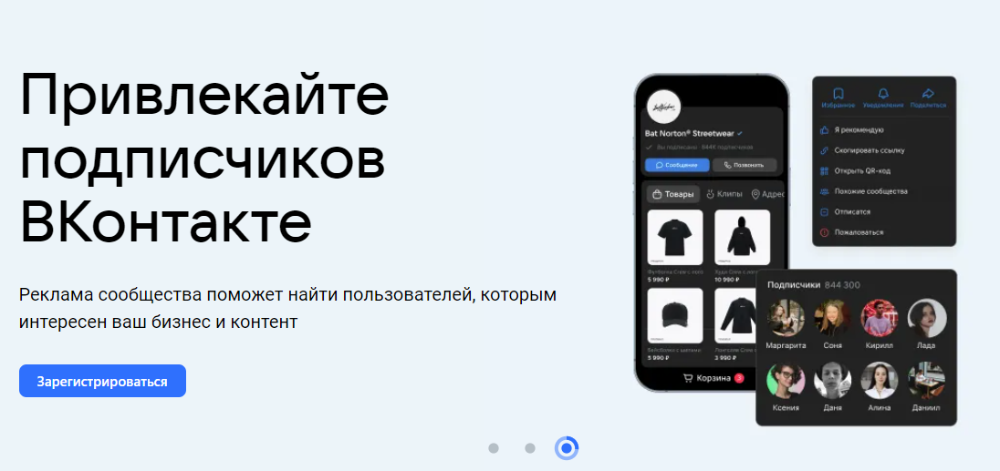

## Главная страница (для неавторизованных пользователей)

При переходе по ссылке https://ads.vk.com/ открывается главная страница.

На ней присутствуют следующие элементы:

- панель навигации;
- лента предложений;
- кейсы компаний;
- обучающие вебинары;
- новости;
- различные ссылки на другие разделы.

### Панель навигации

- При нажатии на логотип VK Рекламы ничего не происходит, пользователь остаётся на странице https://ads.vk.com/.
- При нажатии на кнопку "Новости" происходит редирект на страницу https://ads.vk.com/news.
- При наведении на кнопку "Обучение" появляется выпадающее меню с кнопками:

  - "Полезные материалы";
  - "Мероприятия";
  - "Видеокурсы";
  - "Сертификация".

- При нажатии на кнопку "Полезные материалы" происходит редирект на страницу https://ads.vk.com/insights.
- При нажатии на кнопку "Мероприятия" происходит редирект на страницу https://ads.vk.com/events.
- При нажатии на кнопку "Видеокурсы" происходит редирект на страницу https://expert.vk.com/catalog/courses/ с открытием новой вкладки.
- При нажатии на кнопку "Сертификация" происходит редирект на страницу https://expert.vk.com/certification/ с открытием новой вкладки.
- При нажатии на кнопку "Кейсы" происходит редирект на страницу https://expert.vk.com/certification/.
- При нажатии на кнопку "Форум идей" происходит редирект на страницу https://ads.vk.com/upvote.
- При нажатии на кнопку "Монетизация" происходит редирект на страницу https://ads.vk.com/partner с открытием новой вкладки.
- При нажатии на кнопку "Справка" происходит редирект на страницу https://ads.vk.com/partner.
- При нажатии на кнопку "Перейти в кабинет" происходит редирект на форму для входа.

### Лента приложений

- На первом слайде присутствует кнопка "Зарегистрироваться", которая осуществляет редирект на ссылку https://ads.vk.com/promo/firstbonus.
- На втором слайде присутствует кнопка "Зарегистрировать", которая редиректит на форму для входа.
- На третьем слайде присутствует кнопка "Зарегистрировать", которая редиректит на форму для входа.

### Кейсы компаний

- В данном разделе присуствует три ссылки на различные кейсы (на момент написания):
  - При нажатии на первую картинку происходит редирект на https://ads.vk.com/cases/uvelichivaem-kolichestvo-podpischikov-kejs-hoff
  - При нажатии на вторую картинку происходит редирект на https://ads.vk.com/cases/prodvigaem-sajt-i-lid-formu-kejs-a101
  - При нажатии на тертью картинку происходит редирект на https://ads.vk.com/cases/uvelichivaem-okhvat-kejs-gazprombank
- При нажатии на кнопку "Смотреть всё" происхоит редирект на страницу https://ads.vk.com/cases.

### Обучающие вебинары

- При нажатии на кнопку "Подробнее" происходит редирект на страницу https://ads.vk.com/events

### Новости

- При нажатии на кнопку "Подробнее" происходит редирект на страницу https://ads.vk.com/news/portret-auditorii-sayta-vk-reklama.

### Вспомогательные ссылки

- При нажатии на кнопку "Перейти в кабинет" происходит редирект на форму авторизации.
- При нажатии на кнопку "Новости" происходит редирект на страницу https://ads.vk.com/news.
- При нажатии на кнопку "Полезные материалы" происходит редирект на страницу https://ads.vk.com/insights.
- При нажатии на кнопку "Мероприятия" происходит редирект на страницу https://ads.vk.com/events.
- При нажатии на кнопку "Документы" происходит редирект на страницу https://ads.vk.com/documents.
- При нажатии на кнопку "Обучение для бизнеса" происходит редирект на страницу https://expert.vk.com/ с открытием новой вкладки.
- При нажатии на кнопку "Кейсы" происходит редирект на страницу https://ads.vk.com/cases.
- При нажатии на кнопку "Помощь" происходит редирект на страницу https://ads.vk.com/help.
- При нажатии на кнопку "Монетизация" происходит редирект на страницу https://ads.vk.com/partner с открытием новой вкладки.

## Форум идей (для неавторизованных пользователей)

При переходе по ссылке https://ads.vk.com/upvote открывается форум идей.

На странице присутствуют следующие элементы:

- панель навигации;
- поиск идей;
- отдельная идея;
- кнопка для возможности предложить идею;
- дополнительная информация.

### Поиск идей

- При вводе названия идеи производится динамический поиск идей по подстроке в названии идеи.
- При вводе id идеи происходит поиск лишь по полному совпадению id.
- При выборе темы идеи происходит дополнительная сортировка идей по темам.
- При выборе статуса идеи происходит дополнительная сортировка по идей по статусу.
- При невозможности найти идею по имующимся фильтрам происходит отображение кнопки "Сбросить фильтры".

### Предложение идей

- При нажатии на кнопку "Предложить идею" появится моделльное окно с информацией и двумя кнопками, каждая из которых закрывает его.
- Нажатие на любую точку вне модального окна также закрывает его.

### Карточка идеи

- При нажатии на название идеи произойдёт переход на страницу идеи формата https://ads.vk.com/upvote/{id_идеи}.
- При нажатии на кнопку с комментариями появится комментарии под идеей.

- При нажатии на кнопку "Скопировать ссылку на идею" ссылка на идею скопируется в буфер обмена.

## Создание опроса

- При нажатии на кнопку "Лид формы и опросы" происходит редирект (без перезагрузки) на страницу создания лид формы или опроса (https://ads.vk.com/hq/leadads/leadforms).

- При нажатии на кнопку "Опросы" происходит редирект (без перезагрузки) на страницу с возможностью создать опрос (https://ads.vk.com/hq/leadads/surveys).

- При нажатии на кнопку "Создать опрос" появляется модальное окно создания опроса.
- Открытие формы создания опроса будет проверяться по модальному окну с надписью "Новый опрос".

- Вводим необходимые поля формы:
  - Название (название выбираем **случайным**, т.к. **опросы нельзя удалять**, поэтому для проверки уникальности создаём уникальное название);
  - Выбираем логотип (заранее загружаем);
  - Заголовок опроса (**Опрос по вычислительно гидродинамике**);
  - Описание опроса (**Проверка базовых знаний по вычислительной гидродинамике**).
- При загрузке логотипа с правого края экрана открывается специальное окно, в котором находится заранее загруженная картинка.
- Открытие формы загрузки логотипа будет проверяться по модальному окну с надписью "Медиатека".

- Переходим к пункту "Вопросы", в котором заполняем необходимые вопросы и ответы на них, проверяем их существование и после вводим необходимые данные.
- Данные для тестирования:
  - **Текст вопроса**: Какая форма расчётной сетки обладает min численной диффузией;
  - **Ответ 1**: Многогранная;
  - **Ответ 2**: Прямоугольная.
- Далее, создаём ещё один вопрос, нажав кнопку "Добавить вопрос" и вводим следующие данные:
  - **Текст вопроса**: Какие модели многофазности менее требовательны к сетке;
  - **Ответ 1**: Euler-Euler (EMP);
  - **Ответ 2**: Volume of Fluid (VOF);
  - **Ответ 3**: Mixture Multiphase (MMP) (3-й ответ получаем, нажав кнопку "Добавить вариант").

- Переходим к пункту "Результат", вводим следующие данные, чтобы проверить возможность внесения:
  - **В инпут "Заголовок"**: Спасибо за ответы!
  - **В инпут "Описание"**: Ответы получены :)
- Нажимаем кнопку "Запустить опрос".

- После создания опроса, созданный опрос появляется в списке всех опросов (проверяем его по названию и времени создания).

- Далее заходим во вновь созданный опрос и проверяем всё то, что было введено ранее.
- В данном случае проверка открытия будет осуществляться по проверке возможности редактирования опроса, а не по превью, т.к. на превью присутсвуют те же данные, что и при редактировании вопроса. Также при редактировании опроса справа присутсвует встроенное превью, которое дублирует данные, поэтому проверим лишь то, что данные сохранились в самом опросе и не отличаются от того, что было введено ранее.

- На первой странице должны быть введены данные (логотип не проверяем, т.к. он не поддаётся проверке):
  - Название (название выбираем **случайным**, т.к. **опросы нельзя удалять**, поэтому для проверки уникальности создаём уникальное название);
  - Заголовок опроса (**Опрос по вычислительно гидродинамике**);
  - Описание опроса (**Проверка базовых знаний по вычислительной гидродинамике**).
- На второй странице:
  - **Текст 1-го вопроса**: Какая форма расчётной сетки обладает min численной диффузией;
    - **Ответ 1**: Многогранная;
    - **Ответ 2**: Прямоугольная.
  - **Текст 2-го вопроса**: Какие модели многофазности менее требовательны к сетке;
    - **Ответ 1**: Euler-Euler (EMP);
    - **Ответ 2**: Volume of Fluid (VOF);
    - **Ответ 3**: Mixture Multiphase (MMP) (3-й ответ получаем, нажав кнопку "Добавить вариант").
- На третьей странице:
  - **В инпуте "Заголовок"**: Спасибо за ответы!
  - **В инпуте "Описание"**: Ответы получены :)

